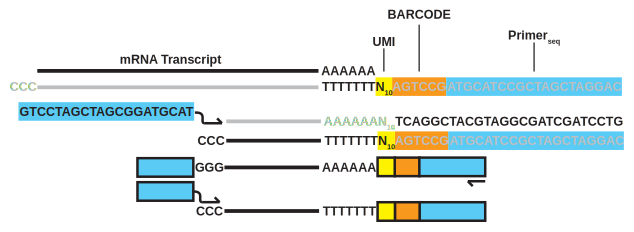

```{r setup, include=FALSE}
library( flexdashboard )
library( tidyverse )
library( kableExtra )
library( formattable )
library( ggrepel )
library( ggridges )
library( ggforce )
library( gtable )
library( grid )

source("figs.R")
```

<p id="title">Drug mechanisms of action predict neurodegeneration in Alzheimer's patients</p>
<table style="width:100%"><tr>
<td style="width:20%;"></td>
<td><p style="text-align:center;font-size:150%">
Steven Rodriguez<sup>1,2</sup>, Petar Todorov<sup>2</sup>, Nienke Moret<sup>2</sup>, Bradley Hyman<sup>1</sup>, Peter Sorger<sup>2</sup>, Mark Albers<sup>1,2</sup>, Artem Sokolov<sup>2</sup>  
<sup>1</sup>Mass. General Institute for Neurodegenerative Disease  
<sup>2</sup>Laboratory of Systems Pharmacology, Harvard Medical School
</p></td>
<td style="width:20%"></td>
</tr></table>

Column {data-width=33%}
-----------------------------------------------------------------------

### Abstract

Alzheimer's Disease (AD) is a growing epidemic as longer life expectancy fuels its principal risk factor - aging. As understanding of AD grows in the setting of many failed clinical trials, the concept of AD as a single disease is giving way to the hypothesis that it is a syndrome with multiple disease pathways progressing towards a common end-stage clinical presentation. Here, we aim to identify FDA-approved drugs that target these pathways and thus are candidates for repurposing in AD.

Given an FDA-approved drug, we asked if its mechanism of action is related to AD biology by training a predictor of disease stage. The predictor was limited to using expression of genes known to be associated with the drug, and its performance was compared to predictors constructed on randomly-selected gene sets of equal size. Thirty top-performing drugs were subsequently profiled on human neuroprogenitor cell lines that differentiate into a mixed culture of neurons, glia and oligodendroctyes to further refine their mechanisms of action in relevant cell types. Jak inhibitors Tofacitinib and Ruxolitinib were among the top performers, and additional in vitro experiments demonstrated that the two drugs can rescue inflammatory-induced neuronal death, suggesting their potential as repurposing candidates for AD.

### Introduction

#### Joint effort

```{r}
figJointEffort() %>% htmltools::div(id="fig-jeffort", style="width:25%;height:auto;float:left;")
```

The work presented here is a part of the joint effort to identify FDA-approved drugs that can be repurposed for Alzheimer’s Disease. The joint effort spans three distinct approaches to the problem: 1) mining of electronic health records, 2) identifying correlations between molecular mechanisms of drugs and the disease, and 3) *in vitro* experiments to assess drugs’ capacity to rescue neurodegeneration. Each approach systematically **generates** hypotheses about potential repurposing candidates, while also **validating** hypotheses generated by its two counterparts. This poster focuses on results of the molecular analyses and *in vitro* experiments.

#### Data overview

```{r}
## Visulize ROSMAP statistics, produced by ROSMAP_stats()
## T1cap <- '<span id="table1cap">Table 1: Grouping of ROSMAP samples by their Braak score</span>'
ROSMAP_stats() %>% mutate( Category = text_spec(Category,"html",font_size="200%"),
           `#Samples` = color_bar("#FFA99A")(`#Samples`) ) %>%
    kable("html", escape=FALSE, align=c("c","r","c","c"), table.attr = 'id="rosmap"') %>%
    kable_styling( full_width=FALSE, position="left" ) %>%
    column_spec(2:4, width="3em") %>%
    column_spec(1, width="2em" ) %>%
    column_spec(1:2, bold=TRUE) %>%
    collapse_rows(columns=3:4, valign="middle")
```
On the molecular level, AD is characterized by two main types of lesions: beta-amyloid plaques and neurofibrillary tangles[@jouanne2017tau]. The tangles arise from abnormal phosphorylation of tau, proteins that stabilize microtubules in neurons of the central nervous system. Propagation of tangles through the brain is used by pathologists to diagnose disease stage, known as the Braak score, in individual patients. 

To identify associations between drug mechanisms of action and neurodegeneration, we used The Religious Orders Study and Memory and Aging Project (ROSMAP) dataset[@ros2012overview;@map2012overview], which is available through the AMP-AD knowledge portal at [https://www.synapse.org/ampad](https://www.synapse.org/ampad). Samples in the dataset were grouped by their Braak score, as shown in the table, to establish a three-class prediction task that distinguishes between early (A), intermediate (B), and late (C) stages of AD.

Column {data-width=34%}
-----------------------------------------------------------------------

### Computational setup

#### Prediction of disease stage from RNAseq data

We trained predictors of disease stage category (A, B or C) using RNAseq expression data collected on the same set of samples. Rather than using full transcriptional profiles, we reduced the gene space to sets known to be associated with specific FDA-approved drugs of interest. By comparing predictors trained on drug-related gene sets against those trained on randomly-selected sets, we generated hypotheses about drugs' relevance to neurodegeneration.

#### Background performance on randomly-selected gene sets

```{r fig.width=4.5, fig.height=2.5, out.width='50%', out.extra='style="float:left;margin-right:5px"'}
figBkPerf()
```

We investigated how well randomly-selected gene sets are able to predict disease stage by comparing all binary combinations of A, B, C labels, as well as considering ordinal regression. The figure shows how the performance changes with the size of gene sets and task definition. As expected, recognizing early (A) vs. late(C) disease stages is an easier prediction task than the other formulations.

#### Gene set as a unit of biological knowledge

```{r fig.width=5, fig.height=2.5, out.width='50%', out.extra='style="float:right"'}
figGSBK()
```

Given a gene set of interest, we ask how well a predictor trained on the expression of those genes is able to predict disease stage compared to predictors trained on randomly-selected sets of the same size. If the gene set of interest leads to significantly higher performance than random sets, then it might be evidence of association between those genes and disease.

#### Top candidates

```{r fig.width=7, fig.height=5, out.width='90%', fig.align="center"}
figTopCand()
```

We composed a map of drug-gene associations by mining publicly-available resources KINOMEscan [http://lincs.hms.harvard.edu/kinomescan/](http://lincs.hms.harvard.edu/kinomescan/), DrugBank [https://www.drugbank.ca/](https://www.drugbank.ca/) and ChEMBL [https://www.ebi.ac.uk/chembl/](https://www.ebi.ac.uk/chembl/). The resulting gene sets were compared against randomly-selected sets of equal size, and the results for the top 10 candidates are presented in the figure.

Column {data-width=33%}
-----------------------------------------------------------------------

### Digital Gene Expression

#### DGE allows for concurrent profiling of a 384-well plate




#### Gene sets derived from differential expression yield improved performance

```{r}
figDGEres()
```

### Rescue of Neurodegeneration

Steve's data on cell viability here

### Acknowledgments

This work was sponsored by NIH grant 1R56AG058063-01: **Harnessing Diverse BioInformatic Approaches to Repurpose Drugs for Alzheimer’s Disease.**

The authors would like to thank Sarah Boswell and Feodor Price for their help with the Digital Gene Expression platform and John Hoffer for his help with CSS formatting and style.

### References


